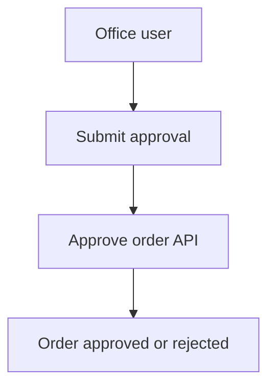

# Documentation Guidelines Reference

Use this reference when creating or reorganizing documentation for a monorepo or single-project repository. The goal is to make documentation prompt-addressable: when a user names a repo, module, or feature, an AI agent can route to the correct source-of-truth docs without guessing.

## Core Model

Root `docs/README.md` is the project documentation router. It maps natural-language prompt names to repo paths, module indexes, feature indexes, cross-repo relationships, and independent areas.

Detailed docs live with the owner:

- In monorepos, detailed docs always live inside the owning repo, such as `apps/api/docs/...` or `services/worker/docs/...`.
- In single-project repos, detailed docs live under root `docs/...`.
- Root docs link, summarize, and coordinate. They do not duplicate implementation details owned by child repos.

## Recommended Folder Shapes

### Monorepo

```text
docs/
  README.md
  naming-and-structure.md
  relationship-map.md
  runbooks/
    README.md
  decisions/
    README.md

apps/api/
  README.md
  docs/
    README.md
    modules.md
    features.md
    architecture/
      README.md
    runbooks/
      README.md
    modules/
      order/
        order-module.md
        features/
          approve-order-api-feature.md
        workflows/
          order-approval-workflow.md
        runbooks/
          debug-order-approval-runbook.md
        order-testing.md
    reference/
      api-errors-reference.md

apps/office-web/
  README.md
  docs/
    README.md
    modules.md
    features.md
    architecture/
      README.md
    runbooks/
      README.md
    modules/
      order-management/
        order-management-module.md
        features/
          approve-order-office-ui-feature.md
        workflows/
          order-approval-screen-workflow.md
        order-management-testing.md
```

### Single Project

```text
docs/
  README.md
  naming-and-structure.md
  modules.md
  features.md
  architecture/
    README.md
  modules/
    order/
      order-module.md
      features/
        approve-order-api-feature.md
      workflows/
        order-approval-workflow.md
      runbooks/
        debug-order-approval-runbook.md
      order-testing.md
  reference/
    api-errors-reference.md
  runbooks/
    README.md
```

## File Naming Rules

Use explicit suffixes for detailed docs so developers can find files quickly by name and do not need to open many repeated `README.md` files.

| Suffix | Use For | Example |
| :--- | :--- | :--- |
| `-module.md` | Module overview, ownership boundary, source paths, feature index | `order-module.md` |
| `-feature.md` | One feature, workflow surface, or API contract | `approve-order-api-feature.md` |
| `-workflow.md` | Multi-step business or UI flow larger than one feature doc | `order-approval-workflow.md` |
| `-runbook.md` | Debugging, operations, maintenance, incident response | `debug-order-approval-runbook.md` |
| `-reference.md` | Catalogs, legacy references, external mappings | `api-errors-reference.md` |
| `-testing.md` | Test matrix, verification commands, test data rules | `order-testing.md` |
| `-roadmap.md` | Plans, phases, milestones, rollout sequencing | `order-roadmap.md` |

Reserve `README.md` for root/repo entrypoints and intentional folder indexes such as `docs/README.md`, repo `docs/README.md`, `architecture/README.md`, and `runbooks/README.md`. Do not create `docs/modules/<module-id>/README.md` for new module docs when the project follows suffix naming.

## Root `docs/README.md` Template

````markdown
---
name: Project Documentation Index
description: Root documentation index for resolving repos, modules, features, ownership, and cross-repo relationships.
version: 1.0.0
last_updated: YYYY-MM-DD
maintained_by: Engineering Team
project_shape: monorepo
---

# Project Documentation Index

## How AI Agents Should Read This Project

1. Match the user's prompt against the Repo Prompt Names table.
2. Match the requested module against the Module Locator or repo-level module indexes.
3. Match the requested feature against the repo-level feature indexes linked from this file.
4. Read the owning repo docs index.
5. Read the owning module docs.
6. Read related docs marked as `Required` in the Relationship Map.
7. Skip unrelated independent/tooling areas unless the prompt explicitly names them.

## Repo Prompt Names

| Prompt Name | Repo ID | Path | Type | Docs Index | Responsibility | Coordination Scope | Notes |
| :--- | :--- | :--- | :--- | :--- | :--- | :--- | :--- |
| API Repo | api | `apps/api` | Backend API | `apps/api/docs/README.md` | Owns API contracts, database rules, permissions, jobs, events | Required for web/mobile features that consume API contracts | Source of truth for order approval business rules |
| Office Web Repo | office-web | `apps/office-web` | Frontend web app | `apps/office-web/docs/README.md` | Owns office UI workflows, route guards, client state, API consumption | Required when API changes affect office workflows | Consumes Order Module APIs |
| Tooling Repo | tooling | `tools` | Internal tooling | `tools/docs/README.md` | Owns local scripts and developer utilities | None by default | No product runtime dependency |

## Repo Documentation Indexes

| Repo Prompt Name | Repo ID | Module Index | Feature Index | Architecture Index | Runbooks | Notes |
| :--- | :--- | :--- | :--- | :--- | :--- | :--- |
| API Repo | api | `apps/api/docs/modules.md` | `apps/api/docs/features.md` | `apps/api/docs/architecture/README.md` | `apps/api/docs/runbooks/README.md` | Owns backend contracts |
| Office Web Repo | office-web | `apps/office-web/docs/modules.md` | `apps/office-web/docs/features.md` | `apps/office-web/docs/architecture/README.md` | `apps/office-web/docs/runbooks/README.md` | Consumes API contracts |
| Tooling Repo | tooling | `tools/docs/modules.md` | `tools/docs/features.md` | `tools/docs/architecture/README.md` | `tools/docs/runbooks/README.md` | Independent by default |

## Module Locator

| Repo Prompt Name | Module Name | Module ID | Owner Docs | Main Features | Related Areas | Coordination Required | Notes |
| :--- | :--- | :--- | :--- | :--- | :--- | :--- | :--- |
| API Repo | Order Module | order | `apps/api/docs/modules/order/order-module.md` | Order creation, approval, cancellation | Office Web Repo / Order Management Module | Yes | API contract owner |
| Office Web Repo | Order Management Module | order-management | `apps/office-web/docs/modules/order-management/order-management-module.md` | Order list, order detail, approval UI | API Repo / Order Module | Yes | Consumer of API Repo order contracts |
| Tooling Repo | Import Tools Module | import-tools | `tools/docs/modules/import-tools/import-tools-module.md` | CSV import helpers | None | No | Independent developer tooling |

## Feature Indexes

Root docs link to repo-level feature indexes instead of listing every feature.

| Repo Prompt Name | Feature Index | Scope | Notes |
| :--- | :--- | :--- | :--- |
| API Repo | `apps/api/docs/features.md` | Backend/API features and API contract owners | Feature names and IDs must be globally unique |
| Office Web Repo | `apps/office-web/docs/features.md` | Office web workflows and UI feature docs | Feature names and IDs must be globally unique |
| Tooling Repo | `tools/docs/features.md` | Tooling features, scripts, and local automation | Independent unless explicitly related |

## Cross-Repo Relationship Map

| Source | Target | Level | Relationship | Contract Owner | Read When | Required Docs | Notes |
| :--- | :--- | :--- | :--- | :--- | :--- | :--- | :--- |
| Office Web Repo / Order Management Module | API Repo / Order Module | Required | Consumes REST API and error contracts | API Repo | Designing or changing order workflows | `apps/api/docs/modules/order/order-module.md` | UI must not duplicate API business rules |
| API Repo / Order Module | Office Web Repo / Order Management Module | Recommended | Provides API behavior used by office workflows | API Repo | Changing payloads, statuses, permissions, errors | `apps/office-web/docs/modules/order-management/order-management-module.md` | Review consumer impact |
| Tooling Repo / Import Tools Module | API Repo / Order Module | None | No runtime relationship | None | Only when prompt mentions import tools | None | Do not broaden scope automatically |

## Independent Areas

| Prompt Name | Path | Why Independent | Relationship Scope | When To Read |
| :--- | :--- | :--- | :--- | :--- |
| Tooling Repo | `tools` | Developer utilities only; no product runtime contract | None | Read only when prompt mentions tools, scripts, imports, or local developer workflow |

## Update Rules

- Add every new repo prompt name before using it in docs or prompts.
- Add every new module to the root Module Locator and the owning repo `modules.md`.
- Add every user-facing, API-facing, or workflow-critical feature to the owning repo `features.md`.
- Keep canonical module names, module IDs, canonical feature names, and feature IDs unique across the whole project.
- Update the Relationship Map when a feature consumes another repo's API, event, queue, storage, config, or shared package contract.
- Mark independent areas explicitly instead of leaving relationships blank.
````

## Repo-Level `modules.md` Template

````markdown
---
name: API Repo Module Index
description: Module index for API Repo.
version: 1.0.0
last_updated: YYYY-MM-DD
maintained_by: Backend Team
repo_prompt_name: API Repo
repo_id: api
---

# API Repo Module Index

| Module Name | Module ID | Owner Docs | Main Features | Related Areas | Coordination Required | Notes |
| :--- | :--- | :--- | :--- | :--- | :--- | :--- |
| Order Module | order | `modules/order/order-module.md` | Approve Order API | Office Web Repo / Order Management Module | Yes | API contract owner |
````

## Repo-Level `features.md` Template

````markdown
---
name: API Repo Feature Index
description: Feature index for API Repo.
version: 1.0.0
last_updated: YYYY-MM-DD
maintained_by: Backend Team
repo_prompt_name: API Repo
repo_id: api
---

# API Repo Feature Index

| Feature Name | Feature ID | Module Name | Owner Doc | Status | Related Docs | Verification |
| :--- | :--- | :--- | :--- | :--- | :--- | :--- |
| Approve Order API | approve-order-api | Order Module | `modules/order/features/approve-order-api-feature.md` | Planned | `../../office-web/docs/modules/order-management/features/approve-order-office-ui-feature.md` | API tests, seed approval scenarios |
````

## Module Doc Template

Place module docs at `docs/modules/<module-id>/<module-id>-module.md` inside the owning repo. Reserve `README.md` for root/repo entrypoints and intentional index folders.

````markdown
---
name: Order Module
description: Backend order domain, API contracts, state transitions, jobs, and audit behavior.
version: 1.0.0
last_updated: YYYY-MM-DD
maintained_by: Backend Team
repo_prompt_name: API Repo
repo_id: api
module_name: Order Module
module_id: order
module_aliases:
  - Orders
related_docs:
  - ../../features.md
  - ../../../../office-web/docs/modules/order-management/order-management-module.md
---

# Order Module

## Purpose

Describe what this module owns and why it exists.

## Ownership Boundary

| Owned Here | Owned Elsewhere |
| :--- | :--- |
| Order API contracts, state transitions, persistence, audit rules | Office workflow rendering and local UI state |

## Prompt Names

| Type | Canonical | Aliases |
| :--- | :--- | :--- |
| Repo | API Repo | Backend API |
| Module | Order Module | Orders |

## Source Paths

| Area | Paths | Notes |
| :--- | :--- | :--- |
| Routes | `routes/api.php` | Order endpoints |
| Controllers | `app/Http/Controllers/OrderController.php` | API entrypoints |
| Models | `app/Models/Order.php` | Order persistence |
| Jobs | `app/Jobs/*Order*.php` | Async side effects |

## Public Contracts

| Contract | Owner | Consumer | Doc |
| :--- | :--- | :--- | :--- |
| Order approval REST API | API Repo / Order Module | Office Web Repo / Order Management Module | `features/approve-order-api-feature.md` |

## Data Model

Use tables and Mermaid ERDs when they clarify relationships.

## Feature Index

| Feature Name | Feature ID | Doc | Status |
| :--- | :--- | :--- | :--- |
| Approve Order API | approve-order-api | `features/approve-order-api-feature.md` | Planned |

## Cross-Repo Relationships

| Target | Level | Relationship | Required Docs | Notes |
| :--- | :--- | :--- | :--- | :--- |
| Office Web Repo / Order Management Module | Required | Consumes order approval contract | `../../../../office-web/docs/modules/order-management/order-management-module.md` | Review client impact when statuses, payloads, permissions, or errors change |

## Local Development

Document setup commands, seeders, migrations, environment assumptions, and data scenarios.

## Testing

Document focused unit, integration, contract, and E2E commands.

## Debugging

Document logs, tracing keys, common symptoms, and reproduction steps.

## Known Constraints

Document edge cases, historical decisions, migration risks, and compatibility limits.
````

## Feature Doc Template

Place feature docs at `docs/modules/<module-id>/features/<feature-id>-feature.md` inside the owning repo.

````markdown
---
name: Approve Order API
description: API contract and backend business rules for approving pending orders.
version: 1.0.0
last_updated: YYYY-MM-DD
maintained_by: Backend Team
repo_prompt_name: API Repo
repo_id: api
module_name: Order Module
module_id: order
feature_name: Approve Order API
feature_id: approve-order-api
feature_aliases:
  - Order Approval API
related_docs:
  - ../order-module.md
  - ../../../features.md
  - ../../../../../office-web/docs/modules/order-management/features/approve-order-office-ui-feature.md
---

# Approve Order API

## Summary

Describe the feature and the business outcome in one paragraph.

## Owner

| Field | Value |
| :--- | :--- |
| Repo | API Repo |
| Module | Order Module |
| Feature | Approve Order API |
| Maintainer | Backend Team |

## Status

Planned, active, deprecated, or archived.

## Scope

| Included | Excluded |
| :--- | :--- |
| Backend approval validation, state transition, audit, API response | Office UI layout and client-only rendering |

## Actor Flow



## System Flow

Document services, events, jobs, side effects, transactions, retries, and cache invalidation.

## Contracts

| Method | Path | Guard/Scope | Request | Response | Errors | Notes |
| :--- | :--- | :--- | :--- | :--- | :--- | :--- |
| POST | `/api/orders/{order}/approve` | `orders:approve` | `ApproveOrderRequest` | `OrderResource` | `ERR_ORDER_LOCKED`, `ERR_INVALID_STATE` | Approves only pending orders |

## Payloads And Responses

Provide canonical JSON examples for request, success response, validation failure, authorization failure, and business-rule failure.

## Data Rules

| Rule | API Behavior | Client Consumption |
| :--- | :--- | :--- |
| Order is not pending | API rejects approval with `ERR_INVALID_STATE` | Client must treat error code as source of truth |

## Cross-Repo Impact

| Consumer | Level | Required Docs | Impact |
| :--- | :--- | :--- | :--- |
| Office Web Repo / Order Management Module | Required | `../../../../../office-web/docs/modules/order-management/features/approve-order-office-ui-feature.md` | UI consumes status, permissions, and error codes |

## Testing Plan

| Test Type | Command | Scenarios |
| :--- | :--- | :--- |
| API integration | `php artisan test --filter=ApproveOrderTest` | Pending, locked, invalid state, permission denied |

## Debugging Notes

| Symptom | Where To Look | Notes |
| :--- | :--- | :--- |
| Approval rejected unexpectedly | API logs, audit entries, order state | Check state transition guard |

## Rollout And Migration

Document feature flags, migrations, backfills, compatibility, and rollback concerns.

## Change History

| Version | Date | Change |
| :--- | :--- | :--- |
| 1.0.0 | YYYY-MM-DD | Initial contract |
````

## Backend/API Contract Checklist

Backend/API feature docs should include:

- Purpose, scope, consumers, and ownership boundary.
- Controllers, routes, requests, resources, models, services, jobs, providers, constants, and config.
- Endpoint table with method, path, guard/scope, request, response, errors, and notes.
- Required headers, payload examples, response examples, and error dictionary.
- Permissions, token abilities, feature flags, rate limits, audit rules, and client consumption rules.
- Data model, state transitions, events, queues, cache behavior, side effects, and external dependencies.
- Local development, seed data, migrations, verification commands, troubleshooting hints, and test commands.

## Client/Workflow Checklist

Client/workflow docs should include:

- Entry points, routes, screens, and workflow ownership.
- API or realtime contracts consumed, linked to owner docs.
- Local state/storage behavior and client-only constraints.
- UX and rendering rules without duplicating backend business rules.
- Compatibility notes, rollout notes, verification commands, and debugging notes.

Client docs should use a consumption table instead of copying backend rules:

| Consumed Contract | Owner | Local Usage | Required Client Behavior |
| :--- | :--- | :--- | :--- |
| `POST /api/orders/{order}/approve` | API Repo / Order Module | Submit approval action | Use API error codes as source of truth for blocked states |

## Relationship Levels

| Level | Meaning | AI Behavior |
| :--- | :--- | :--- |
| `Required` | Change may break another repo, contract, workflow, or test surface | Read before proposing or editing |
| `Recommended` | Related context may affect UX, rollout, tests, or integration quality | Read for design, contract, workflow, or user-facing work |
| `Optional` | Useful background only; not blocking | Mention as context and read only if the task needs it |
| `None` | No expected coordination | Do not broaden scope unless the prompt explicitly asks |

Use `Optional` only for background context. If a related doc can change contract behavior, rollout, tests, or user-facing behavior, use `Recommended` or `Required`.

## AI Prompt Resolution Workflow

When a user asks for design, implementation, debugging, or testing work:

1. Read root `docs/README.md`.
2. Resolve repo prompt name from the user prompt.
3. Resolve module name or feature name. Canonical names and IDs are project-wide unique, so a named feature should identify one owner doc.
4. If the prompt names both repo and module, trust that routing unless docs show ambiguity.
5. Read the owning repo docs index.
6. If the prompt only names a feature, use repo-level feature indexes linked from root `docs/README.md` to find its owner doc.
7. Read the owning module `*-module.md`.
8. Read existing feature docs if the feature already exists.
9. Read relationship docs marked `Required`.
10. For design work, also read testing/debug/runbook docs if listed by the module.
11. If the prompt is ambiguous after reading indexes, ask one targeted question instead of guessing.

Example prompt:

```text
I want to build order approval in API Repo, Order Module. Analyze and design the feature.
```

Expected reading path:

| Step | File |
| :--- | :--- |
| Resolve repo/module | `docs/README.md` |
| API repo docs | `apps/api/docs/README.md` |
| API feature index | `apps/api/docs/features.md` |
| Order module docs | `apps/api/docs/modules/order/order-module.md` |
| Existing order approval docs | `apps/api/docs/modules/order/features/approve-order-api-feature.md` if present |
| Related office workflow | `apps/office-web/docs/modules/order-management/order-management-module.md` if Relationship Map says `Required` |
| Debug/testing references | `apps/api/docs/modules/order/order-testing.md`, `apps/api/docs/modules/order/runbooks/debug-order-approval-runbook.md` if present |

## Update Checklist

When adding a new repo, module, feature, or cross-repo behavior:

1. Update root `docs/README.md`.
2. Update the owning repo `docs/README.md`.
3. Update the owning repo `modules.md` or `features.md`.
4. Update or create the owning module `*-module.md`.
5. Create or update feature docs.
6. Confirm canonical module and feature names/IDs are unique across the project.
7. Add cross-repo relationships if contracts, workflows, events, jobs, shared packages, or data dependencies cross repo boundaries.
8. Mark independent areas as `None` when they do not coordinate with product runtime behavior.
9. Add testing and debugging notes close to the owning module/feature docs.
10. Search for stale old paths, old prompt names, old module names, and old feature names.
11. Verify every linked file exists.
12. Confirm detailed docs use explicit suffix filenames: `*-module.md`, `*-feature.md`, `*-workflow.md`, `*-runbook.md`, `*-reference.md`, `*-testing.md`, or `*-roadmap.md`.

## Markdown Style

- Use frontmatter plus Markdown consistently.
- Use tables for repo names, module indexes, feature indexes, relationships, endpoints, business rules, route maps, error dictionaries, testing matrices, and debugging symptom maps.
- Use Mermaid for actor flows, system flows, state machines, and ERDs when helpful.
- Keep Mermaid labels short. Wrap labels with punctuation in quotes.
- Keep docs concise but complete enough for a future engineer to avoid guessing.
- Delete obsolete text and stale references.
- Link to source-of-truth docs instead of duplicating rules across consumers.
